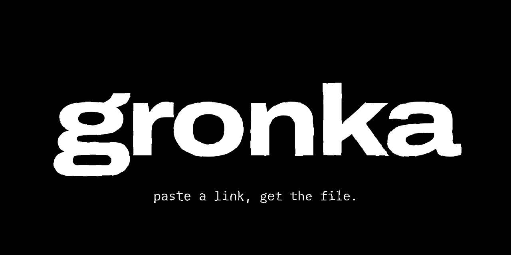

<p align="center">
  
</p>

<p align="center">
  <a href="https://github.com/gronkanium/gronka/actions/workflows/ci.yml"></a>
  <a href="https://github.com/gronkanium/gronka/releases/latest"></a>
  <a href="LICENSE"></a>
  <a href="https://discord.com/oauth2/authorize?client_id=1522194017692156046"></a>
  <a href="https://web.gronka.dev"></a>
</p>

paste a link, get the file. gronka™ downloads media from 40+ sites, turns video into gifs and shrinks
gifs, as a discord bot and on [web.gronka.dev](https://web.gronka.dev).

## commands

- `/download`: a video, image or gallery from a link, or `mp3` for just the audio
- `/convert`: a file or link to a gif (or another format), with quality, lossy and `start`/`end` trimming
- `/optimize`: shrink an existing gif
- `/info`: version, uptime, commands run and what is on r2

right-click a message → apps does the same: **convert to gif**, **download**, **optimize**.

## sites

tiktok, instagram, youtube, x, reddit, soundcloud, bluesky, threads, pinterest, twitch, tumblr, imgur, giphy
and about 30 more, through [cobalt](https://github.com/imputnet/cobalt), yt-dlp, gallery-dl and a few
extractors of its own. the full list is on [web.gronka.dev](https://web.gronka.dev).

## run your own

```bash
git clone https://github.com/gronkanium/gronka.git && cd gronka
bun install
bun run setup             # asks for your token, writes .env and the mounted files
docker compose up -d --build
```

only `DISCORD_TOKEN` and `CLIENT_ID` are required. cookies, cloudflare r2 and everything else are
optional: see the [wiki](https://github.com/gronkanium/gronka/wiki). `bun run setup --help`
lists flags for scripted installs.

self-hosting runs the discord bot. web.gronka.dev is a hosted service built on cloudflare and is
not part of a self-hosted install.

## development

```bash
bun run lint && bun run test:safe && bun run test:e2e
```

plain esm javascript on bun 1.3. issues and PRs welcome, see [CONTRIBUTING](.github/CONTRIBUTING.md).

## license

The code is [MIT](LICENSE): run it, change it, host it for anyone. The gronka™ name, logo and
penguin are trademarks of gronkanium, artwork all rights reserved; see
[TRADEMARKS](.github/TRADEMARKS.md).
